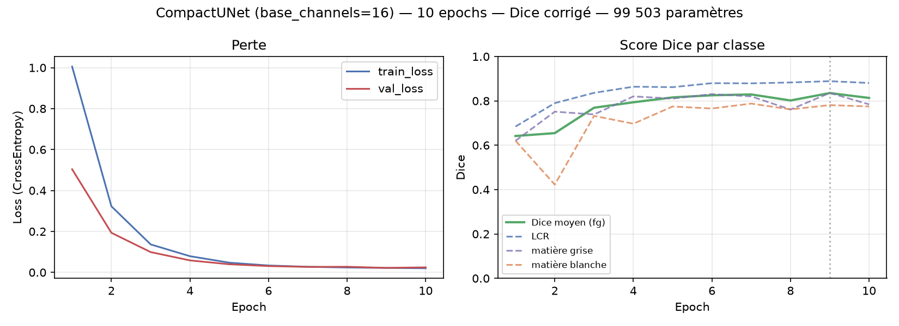
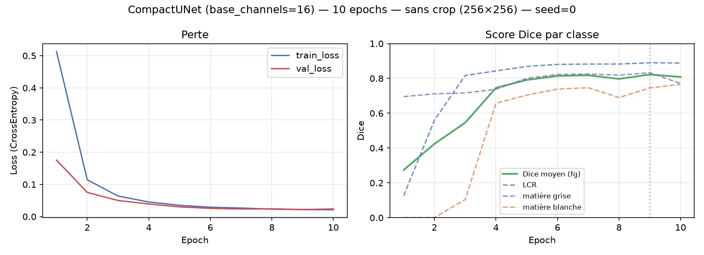
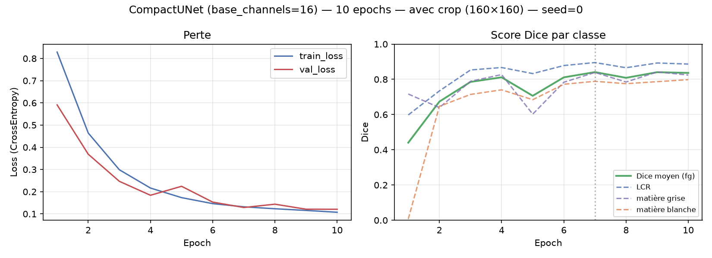

# Rapport d'entraînement — iSeg-2017, CompactUNet

**Challenge :** MICCAI iSeg-2017 — segmentation de la substance blanche, substance grise et liquide céphalo-rachidien (LCR) sur IRM T1/T2 de nourrissons de 6 mois.
**Contrainte du hackathon :** qualité de segmentation *rapportée au nombre de paramètres* — viser un modèle frugal, pas le plus gros réseau possible.
**Métrique :** Dice moyen sur les 3 classes de premier plan (LCR, substance grise, substance blanche), fond exclu — c'est la métrique utilisée par le challenge iSeg-2017 lui-même.

---

## 1. Setup

- **Modèle :** `CompactUNet` — U-Net à convolutions *depthwise-separable* (au lieu de convolutions classiques), pour réduire drastiquement le nombre de paramètres à profondeur égale.
- **Données :** 10 sujets annotés (`dataset/train`), split par **sujet** (pas par tranche) pour éviter toute fuite entre train/validation — sujets 9 et 10 réservés à la validation, 8 sujets pour l'entraînement.
- **Entrée :** tranches axiales 2D, T1 + T2 + ratio T1/T2 normalisé (3 canaux).
- **Environnement :** RTX 3070 (GPU), entraînement exécuté nativement sous Windows (voir note technique en fin de rapport).

## 2. Résultats

### Run 1 — configuration de référence, 2 epochs (test rapide initial)

| Paramètre | Valeur |
|---|---|
| base_channels | 16 |
| depth | 3 |
| Nombre de paramètres | 99 503 |

| Epoch | train_loss | val_loss | Dice LCR | Dice S. grise | Dice S. blanche | **Dice moyen (fg)** |
|---|---|---|---|---|---|---|
| 1 | 0.466 | 0.173 | 0.625 | 0.852 | 0.563 | 0.680 |
| 2 | 0.115 | 0.078 | 0.847 | 0.872 | 0.594 | **0.771** |

Objectif de ce run : valider que le pipeline (données → GPU → modèle → métrique) fonctionne de bout en bout. Résultat encourageant dès 2 epochs, mais la substance blanche reste nettement en retard (contraste le plus faible à cet âge, cf. contexte du challenge).

### Run 2 — même configuration, 20 epochs ⚠️ métrique biaisée, voir Run 3

| Paramètre | Valeur |
|---|---|
| base_channels | 16 |
| depth | 3 |
| Nombre de paramètres | 99 503 |

**Meilleur résultat rapporté : epoch 18 — Dice moyen (fg) = 0.925 — surestimé, voir correctif ci-dessous**

| Epoch | train_loss | val_loss | Dice LCR | Dice S. grise | Dice S. blanche | **Dice moyen (fg)** |
|---|---|---|---|---|---|---|
| 1 | 1.003 | 0.447 | 0.853 | 0.858 | 0.653 | 0.788 |
| 5 | 0.039 | 0.047 | 0.905 | 0.800 | 0.793 | 0.833 |
| 10 | 0.022 | 0.020 | 0.958 | 0.928 | 0.844 | 0.910 |
| 15 | 0.018 | 0.018 | 0.961 | 0.934 | 0.873 | 0.923 |
| **18** | **0.017** | **0.017** | **0.960** | **0.937** | **0.878** | **0.925** |
| 20 | 0.016 | 0.019 | 0.945 | 0.923 | 0.851 | 0.906 |

**Ratio d'efficacité rapporté : 9,30 points de Dice pour 1M de paramètres** — chiffre corrigé au run suivant.

### ⚠️ Correctif — biais dans le calcul du Dice de validation

Le Dice des runs 1 et 2 ci-dessus est **surestimé** à cause d'un défaut de la fonction d'agrégation (`dice_per_class` dans [train.py](../src/brainviz/train.py)) : le Dice était calculé **séparément sur chaque batch de 16 coupes**, puis ces scores étaient moyennés en pondérant par la taille du batch.

Or la validation parcourt les coupes des sujets 9 et 10 dans leur ordre anatomique, et certaines classes (notamment le LCR) sont **absentes de nombreux batches entiers** — ni dans la cible, ni dans la prédiction. Dans ce cas, la formule `(2·intersection + ε) / (union + ε)` renvoie **1.0** (grâce au epsilon de lissage), c'est-à-dire un Dice parfait "gratuit" pour un batch où le modèle n'a rien à prédire. Ces faux positifs gonflent artificiellement la moyenne pondérée finale.

**Correctif appliqué** (voir [train.py](../src/brainviz/train.py), fonction `dice_intersection_union`) : intersection et union sont désormais **accumulées sur l'ensemble du jeu de validation**, et le Dice par classe n'est calculé **qu'une seule fois à la fin**, sur ces totaux — ce qui élimine l'effet des batches vides et donne la vraie métrique volumique du challenge iSeg-2017.

### Run 3 — reprise du Run 2, Dice corrigé, 10 epochs

| Paramètre | Valeur |
|---|---|
| base_channels | 16 |
| depth | 3 |
| Nombre de paramètres | 99 503 |

**Meilleur résultat : epoch 9 — Dice moyen (fg) = 0.835**

| Epoch | train_loss | val_loss | Dice LCR | Dice S. grise | Dice S. blanche | **Dice moyen (fg)** |
|---|---|---|---|---|---|---|
| 1 | 1.005 | 0.504 | 0.684 | 0.620 | 0.621 | 0.642 |
| 3 | 0.137 | 0.099 | 0.836 | 0.739 | 0.732 | 0.769 |
| 5 | 0.047 | 0.040 | 0.862 | 0.810 | 0.775 | 0.816 |
| 7 | 0.027 | 0.027 | 0.879 | 0.820 | 0.788 | 0.829 |
| **9** | **0.022** | **0.022** | **0.889** | **0.836** | **0.781** | **0.835** |
| 10 | 0.020 | 0.025 | 0.881 | 0.784 | 0.775 | 0.813 |

**Ratio d'efficacité corrigé : 8,39 points de Dice pour 1M de paramètres** (99 503 paramètres).

Ce run n'est **pas une mesure isolée du biais** : l'entraînement n'est pas seedé (`train.py` ne fixe aucune graine aléatoire), donc Run 2 et Run 3 sont deux entraînements distincts — la comparaison epoch par epoch mélange l'effet du bug et la variance normale entre deux runs (poids initiaux et ordre de mélange des données différents ; on le voit déjà sur la train_loss de l'epoch 1 : 1.0028 vs 1.0052, proches mais pas identiques).

| Epoch | Dice fg (Run 2, biaisé) | Dice fg (Run 3, corrigé) | écart |
|---|---|---|---|
| 1 | 0.788 | 0.642 | 0.146 |
| 2 | 0.836 | 0.655 | 0.181 |
| 3 | 0.856 | 0.769 | 0.087 |
| 4 | 0.865 | 0.794 | 0.072 |
| 5 | 0.833 | 0.816 | 0.017 |
| 6 | 0.883 | 0.825 | 0.058 |
| 7 | 0.891 | 0.829 | 0.062 |
| 8 | 0.897 | 0.802 | 0.095 |
| 9 | 0.882 | 0.835 | 0.047 |
| 10 | 0.910 | 0.813 | 0.097 |

L'écart varie de 0.02 à 0.18 selon l'epoch — beaucoup trop instable pour être uniquement le biais (qui devrait croître avec le nombre de batches vides rencontrés, pas fluctuer erratiquement). Ce tableau confirme la **direction** de l'analyse (le Dice biaisé est systématiquement plus haut, sur les 10 epochs sans exception), mais **pas une magnitude précise** — pour l'isoler proprement il faudrait relancer avec une seed fixée et comparer les deux formules de Dice sur le même run entraîné. Le chiffre fiable à retenir est donc le Dice corrigé du Run 3 lui-même (0.835), pas la différence Run 2 − Run 3.

### Observations clés

- **Le Dice de validation était surestimé** à cause du biais d'agrégation par batch (voir correctif ci-dessus) — toutes les valeurs de Dice antérieures à ce correctif doivent être relues comme des bornes supérieures optimistes, pas comme la métrique réelle du challenge. L'ampleur exacte du biais n'est pas isolée proprement ici (runs non seedés, voir Run 3) ; seul le sens de l'erreur (toujours à la hausse) est établi avec certitude.
- **La substance blanche reste la classe la plus difficile** (0.775-0.788 dans le run corrigé, contre 0.88-0.89 pour le LCR) — cohérent avec le contexte du challenge : à 6 mois, le contraste substance grise/blanche est au plus bas de toute la première année de vie.
- **Convergence rapide et stable** : la train_loss et la val_loss décroissent régulièrement sur les 9 premières epochs, avec un léger surapprentissage dès l'epoch 10 (Dice moyen 0.835 → 0.813).
- **Vitesse d'entraînement** : ~170-195s/epoch pour ce run (Windows natif, RTX 3070) — plus lent que les ~31s/epoch du Run 2 initial, à investiguer (probablement lié au nombre de workers ou à l'état du GPU au moment du run).

## 3. Prochaines pistes testées / à tester

### Run 4 — crop du fond vs. sans crop, Dice corrigé, seed fixée, 10 epochs (machine Linux, CPU)

**Contexte :** run repris sur une nouvelle machine (Linux, CPU uniquement, pas de GPU disponible) pour établir une comparaison contrôlée entre l'entrée actuelle (tranches paddées à 256×256, beaucoup de fond) et un crop à la bounding box 3D du cerveau (voxels T1/T2 non nuls, cf. [notebooks/test_data.ipynb](../notebooks/test_data.ipynb), section "Crop du fond"). Une seed a été ajoutée à `train.py` (`--seed`, défaut 0) pour rendre les deux runs comparables — jusqu'ici aucun run n'était seedé (cf. limite notée au Run 3).

Même config pour les deux runs : `base_channels=16`, `depth=3`, `lr=1e-3`, `batch_size=16`, `modality=T1T2`, `seed=0`, split val = subject-9/subject-10.

| Run | image | tranches train/val | Dice LCR | Dice S. grise | Dice S. blanche | **Dice moyen (fg)** | temps/epoch | temps total (10 ep) |
|---|---|---|---|---|---|---|---|---|
| sans crop (`runs/baseline_nocrop`) | 256×256 | 2048/512 | 0.890 (ep9) | 0.833 (ep9) | 0.745 (ep9) | **0.822** (ep9) | ~110s | ~18 min |
| avec crop (`runs/crop`, `--crop`) | 160×160 | 874/216 | 0.895 (ep7) | 0.839 (ep7) | 0.789 (ep7) | **0.841** (ep7) | ~14s | ~2,4 min |

**Observations :**
- **~7,6× plus rapide par epoch** (14s vs 110s), cohérent avec la réduction de pixels traités : canvas 256²→160² (~2,6× moins de pixels/tranche) combiné à un nombre de tranches par sujet quasi divisé par 2 (le crop élimine les tranches entièrement vides en bord de volume) — au total ~85% de pixels en moins traités par epoch.
- **Dice légèrement meilleur avec crop** (+0,019 sur le meilleur epoch, et net sur substance blanche : 0.789 vs 0.745) — un seul run par condition, donc pas une preuve de significativité, mais cohérent avec l'hypothèse : moins de fond trivial à apprendre, gradient concentré sur les vraies frontières de tissu.
- Le crop est calculé par sujet mais la taille de canvas finale (160×160 ici) est le max de toute la cohorte, arrondi à un multiple de 8 (compatibilité `depth=3`) — voir `compute_crop_size` dans `brainviz.data.loader`.
- **`train_loss`/`val_loss` ne sont pas comparables entre les deux runs.** `nn.CrossEntropyLoss()` moyenne par pixel, pas par classe : sans crop, 95,2% des pixels sont du fond (contre 71,4% avec crop, mesuré via `BrainSliceDataset.foreground_ratio`) ; le fond étant la classe la plus facile (Dice ≈ 1.0000 dès l'epoch 5 dans les deux runs), sa contribution quasi nulle à la loss tire d'autant plus la moyenne vers le bas que sa part de pixels est grande. La loss plus faible sans crop (0,022 vs 0,116 à l'epoch 9) reflète donc ce déséquilibre de classe, pas un modèle "meilleur" — même piège méthodologique que le biais du Dice moyenné par batch (voir correctif ci-dessus). Le Dice foreground (moyenné par classe, pas par pixel) reste la métrique valide pour comparer les deux runs.

*(pistes encore à tester : Run 2 relancé sur 20 epochs avec le Dice corrigé pour comparaison directe, variante plus frugale `base_channels=8`, variante plus large `base_channels=24`, filtrage des tranches vides via `min_foreground_ratio`, combinaison crop + `min_foreground_ratio`)*

## 4. Note technique — environnement d'exécution

Le premier essai sous WSL2 a provoqué un crash irrécupérable du service WSL (`Wsl/Service/E_UNEXPECTED`), lié à la couche de passthrough GPU (`dxgkrnl`) sous charge CUDA soutenue — aucun résultat exploitable n'en est sorti. L'entraînement a été relancé **nativement sous Windows** (venv Python + `uv`, PyTorch avec roue CUDA `cu128`), ce qui a résolu le problème et donné les résultats ci-dessus sans instabilité.

---
*Rapport généré le 2026-09-04 — à compléter au fil des runs suivants.*
